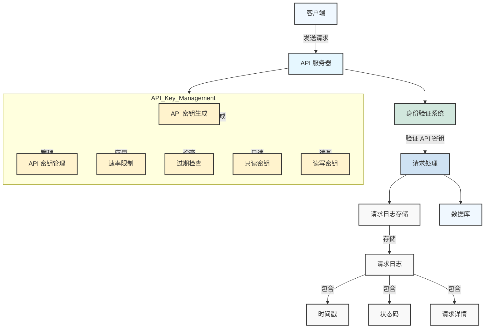

# Api System

```mermaid
flowchart TD
    A[客户端] -->|发送请求| B[API 服务器]
    B --> C[身份验证系统]
    C -->|验证 API 密钥| D[请求处理]
    D --> E[请求日志存储]
    D --> F[数据库]
    
    subgraph API_Key_Management
        G[API 密钥生成]
        H[API 密钥管理]
        I[速率限制]
        J[过期检查]
        K[只读密钥]
        L[读写密钥]
    end

    B --> API_Key_Management
    API_Key_Management -->|生成| G
    API_Key_Management -->|管理| H
    API_Key_Management -->|应用| I
    API_Key_Management -->|检查| J
    API_Key_Management -->|只读| K
    API_Key_Management -->|读写| L

    E -->|存储| M[请求日志]
    M -->|包含| N[时间戳]
    M -->|包含| O[状态码]
    M -->|包含| P[请求详情]

    style A fill:#f0f8ff,stroke:#333,stroke-width:2px
    style B fill:#e6f7ff,stroke:#333,stroke-width:2px
    style C fill:#d1e7dd,stroke:#333,stroke-width:2px
    style D fill:#cfe2f3,stroke:#333,stroke-width:2px
    style E fill:#f9f9f9,stroke:#333,stroke-width:2px
    style F fill:#f0f8ff,stroke:#333,stroke-width:2px
    style G fill:#fff3cd,stroke:#333,stroke-width:2px
    style H fill:#fff3cd,stroke:#333,stroke-width:2px
    style I fill:#fff3cd,stroke:#333,stroke-width:2px
    style J fill:#fff3cd,stroke:#333,stroke-width:2px
    style K fill:#fff3cd,stroke:#333,stroke-width:2px
    style L fill:#fff3cd,stroke:#333,stroke-width:2px
    style M fill:#f9f9f9,stroke:#333,stroke-width:2px
    style N fill:#f9f9f9,stroke:#333,stroke-width:2px
    style O fill:#f9f9f9,stroke:#333,stroke-width:2px
    style P fill:#f9f9f9,stroke:#333,stroke-width:2px
```
